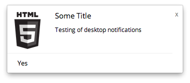

# Nodeifications

Simple cross platform desktop notifications for [node-webkit](https://github.com/rogerwang/node-webkit) apps, inspired by [Chrome Notifications](https://developer.chrome.com/apps/notifications).

## [API Documentation](https://github.com/pbojinov/nodeifications/wiki/Getting-Started) on the wiki

## Getting Started

1. Include the javascript `nodeifications.js` in your application

2. Include the HTML template `nodeifications.html` in your application

3. Create a notification using the API: `DEA.notifications.create(options, callback);`

## Running the demo app

1. Clone this project

        git clone git@github.com:pbojinov/nodeifications.git

2. Run `npm install`

3. Make the nw zip file by running the default gulp task

        gulp

4. `cd` into the project `/src`

5. Run the nw application

	nodewebkit nodeifications.nw

## Building for Production

From the root of the project:

	npm install

	gulp build

Then run the executable/app from inside `/webkitbuilds`

## Application Flow

1. Call the API to create a new notification.

2. `nodeifications.js` creates the HTML template using the user provided content

3. `nodeifications.js` created the notification and appends the template to the created notification window.

4. `nodeifications.html` is simply the container for the content. It handles closing itself and sending off interaction events back to the parent who initiated the notification.

## Notes

- node-webkit version `0.9.2` or later is required for this example (because [`Window.setShowInTaskbar`](https://github.com/rogerwang/node-webkit/wiki/Window#windowsetshowintaskbarboolean-show) is used).

## Notification Types

### Text

### Image

